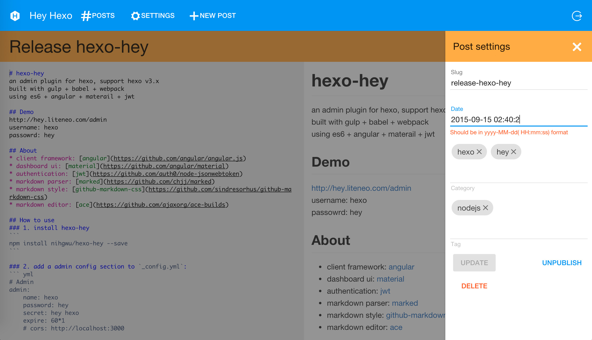
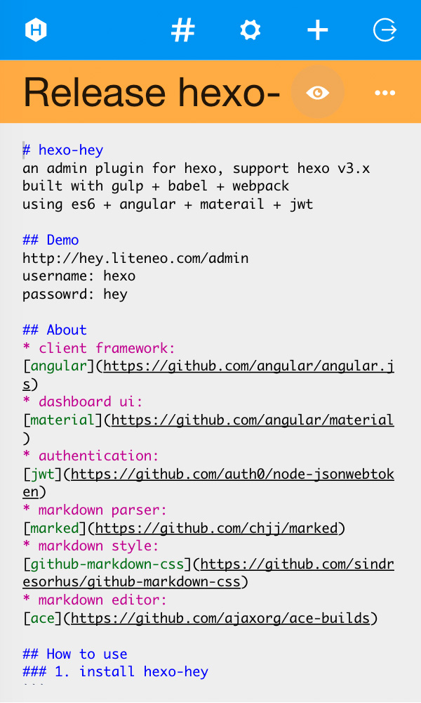

#写在前面
感谢原项目开发者，本工程是原作者项目fork过来的，原作者已经1年多没有更新过项目，  
因此一些库的依赖已升级版本，本工程是在原作者基础上增添一些实用功能。
#更新内容
目的:为配合hexo-theme-material主题的使用，现将在文章编辑页面添加一条属性：  
thumbnail：缩略图地址  
2017-02-16 16:28:00更新内容：编辑中增加缩略图地址编辑功能，出现问题：gulp自动  
打包后无法生成src/api/api.js和index.js两个文件，只好手动修改通过npm安装后的  
hexo下node_modlues/hexo-hey的api.js和index.js  
2017-02-17 13:43:55更新内容：问题已解决，依赖库版本问题

# hexo-hey
an admin plugin for hexo, support hexo v3.x  
built with gulp + babel + webpack  
using es6 + angular + materail + jwt

## Demo
[http://nihgwu.github.io/hexo-hey/](http://nihgwu.github.io/hexo-hey/)  
username: hexo  
passowrd: hey  

## Screenshots



## About
* client framework: [angular](https://github.com/angular/angular.js)
* dashboard ui: [material](https://github.com/angular/material)
* authentication: [jwt](https://github.com/auth0/node-jsonwebtoken)
* markdown parser: [marked](https://github.com/chjj/marked)
* markdown style: [github-markdown-css](https://github.com/sindresorhus/github-markdown-css)
* markdown editor: [codemirror](https://github.com/codemirror/CodeMirror)

## Usage
### 1. install hexo-hey-roc
```
npm install hexo-hey-roc --save
```

### 2. add a admin config section to `_config.yml`:
``` yml
# Admin
admin:
    name: hexo
    password: hey
    secret: hey hexo
    expire: 60*1
    # cors: http://localhost:3000
```
cors is optional if you want serve your client in another place(CDN for example)

### 3. serve hexo
```
hexo serve
```
then visit `http://localhost:4000/admin` , and login with the account set in previous step
